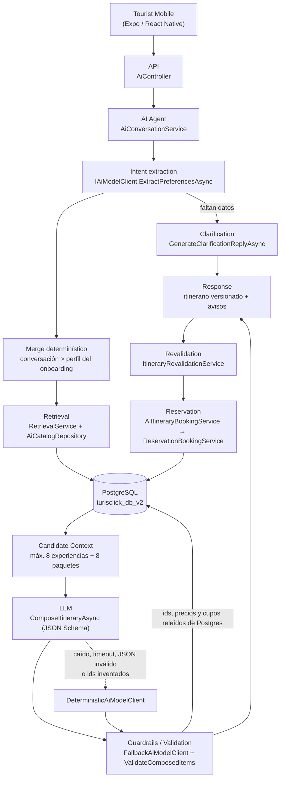

# El agente de TurisClick: qué parte es RAG y qué parte no

Este documento describe cómo funciona el asistente de viajes de TurisClick, con los nombres reales de las clases que lo implementan. Está escrito para poder defenderlo: cada afirmación se puede seguir hasta un archivo del repositorio.

La tesis central es una sola:

> **PostgreSQL es la fuente de verdad. El LLM es un traductor de lenguaje, no un catálogo.**

Todo lo demás —el retrieval, los schemas, los guardrails, el fallback— existe para que esa frase sea verdad incluso cuando el modelo se equivoca.

## 1. Vocabulario, sin buzzwords

Cuatro confusiones que conviene despejar antes de mirar el flujo, porque son las que suelen aparecer en las preguntas:

### LLM ≠ agente

El **LLM** es una función: entra texto, sale texto. No tiene memoria, no consulta la base, no reserva nada, no sabe qué es TurisClick.

El **agente** es el código que orquesta: `AiConversationService`. Es quien mantiene la conversación, decide cuándo faltan datos, llama al retrieval, le pasa candidatos al modelo, valida lo que vuelve, versiona el itinerario y lo persiste. Si mañana se apaga el LLM, el agente sigue existiendo y funcionando (ver §6): eso es la prueba de que el agente no *es* el modelo.

En este repositorio el LLM aparece detrás de exactamente una interfaz, `IAiModelClient`, con cinco operaciones (extraer preferencias, pedir una aclaración, componer, interpretar un ajuste, explicar un ítem). Todo lo demás es C# determinístico.

### Ollama ≠ modelo

**Ollama** es el servidor local que descarga, carga en memoria y expone modelos por HTTP en `localhost:11434`. Es infraestructura, comparable a "Postgres".

**El modelo** es `qwen2.5:7b-instruct`: los pesos. Comparable a "la base de datos `turisclick_db_v2`".

Se cambia de modelo sin tocar código (`AI__Ollama__Model`) y se cambia de proveedor sin tocar código (`AI__Provider`). Ver [`ai-model-selection.md`](ai-model-selection.md).

### RAG ≠ entrenamiento

**Entrenar** (o hacer fine-tuning) es modificar los pesos del modelo para que "sepa" algo. El conocimiento queda congelado dentro del modelo, desactualizado en el momento en que un proveedor cambia un precio, y no se puede auditar.

**RAG** (*Retrieval-Augmented Generation*) es dejar los pesos quietos y **recuperar** el dato correcto en el momento de la consulta, poniéndolo en el prompt como contexto. El conocimiento vive en la base, no en el modelo.

Para TurisClick la diferencia es existencial: si un proveedor publica una experiencia nueva a las 10:00, el asistente la puede recomendar a las 10:01, porque la consulta que la encuentra es un `SELECT`. Con un modelo entrenado habría que reentrenar. Además —y esto es lo que se defiende— **un dato recuperado se puede verificar**: el backend tiene el id, lo vuelve a leer de Postgres y compara. Un dato "recordado" por el modelo no se puede verificar, sólo creer.

### Por qué no entrenamos un modelo desde cero (ni hacemos fine-tuning)

1. **No resolvería el problema.** El problema no es que el modelo no sepa español turístico: es que no puede saber el precio de hoy, el cupo de hoy ni el catálogo de hoy. Ningún entrenamiento arregla eso; sólo lo disfraza.
2. **Introduciría el error más grave posible.** Un modelo entrenado con el catálogo generaría productos plausibles que ya no existen. Una recomendación que no se puede reservar es peor que no recomendar.
3. **Costo y reproducibilidad.** Entrenar exige GPU, datos etiquetados y horas; el resultado no es reproducible para un tribunal ni auditable.
4. **Los datos cambian más rápido que cualquier ciclo de entrenamiento.** Disponibilidad y precios cambian a diario.
5. **No hay volumen de datos que lo justifique.** El catálogo del demo son ~90 experiencias y ~13 paquetes. RAG rinde con 90 productos y con 90.000; el fine-tuning necesita miles de ejemplos etiquetados.

### Qué parte de TurisClick es RAG, con precisión

RAG acá es: **`RetrievalService` + `AiCatalogRepository` (la R) → el bloque de candidatos del prompt (la A) → `IAiModelClient.ComposeItineraryAsync` (la G)**. Ni más ni menos.

Es RAG **estructurado**, no vectorial: la recuperación es SQL sobre columnas reales (destino, estado de publicación, fechas con cupo, categorías, precio), no búsqueda por similitud de embeddings. **No hay base de datos vectorial y no hay `pgvector`.** Se decidió así porque las consultas del dominio son filtros exactos —"Sucre, 3 días, con cupo, publicado, hasta 500 BOB"— y un índice de embeddings no mejora un filtro exacto: sólo agrega un sistema que puede quedar desincronizado del catálogo. Agregar Pinecone o Qdrant para poder decir "RAG" habría sido decoración. Si algún día aparece una necesidad real de match semántico (buscar por descripción libre), `pgvector` en la misma base es el camino, y sigue sin requerir cambiar nada de este pipeline.

## 2. El flujo completo

Los once pasos, uno por uno:

### 1. El turista manda una consulta

`POST /api/ai/conversations/{id}/messages` con texto libre. El mensaje se persiste tal cual (es el historial que el turista ve) y se lo pasa al agente.

### 2. Interpretación de la intención

`AiConversationService` arma un `PreferenceExtractionRequest` con: el mensaje nuevo, los últimos turnos de la conversación, las preferencias ya conocidas y **el vocabulario real** — los nombres de destinos y categorías que existen en la base. Es la primera barrera: el modelo elige de una lista cerrada, no propone desde su imaginación.

Antes de interpretar nada, el texto pasa por `UntrustedUserText.WithoutInjectedInstructions`: los tramos que imitan reglas del sistema (`SYSTEM: …`, "ignorá tus instrucciones") se descartan, así sus números no pueden convertirse en presupuesto ni en cantidad de viajeros.

Si faltan datos mínimos, el agente **no** busca: pide una aclaración (`GenerateClarificationReplyAsync`) y termina el turno.

### 3. El backend recupera candidatos reales

`RetrievalService.RetrieveAsync` → `AiCatalogRepository`, dos consultas SQL (experiencias y paquetes) con estos filtros no negociables:

- `Status == PUBLISHED` y empresa no suspendida,
- destino, si la conversación lo fijó,
- **existe al menos una availability con cupo y fecha ≥ hoy** dentro del rango pedido,
- techo de 50 filas por tipo (`SqlCandidateCap`) — nunca "todo el catálogo".

### 4. Filtros por preferencias y restricciones

Sobre esas filas, todavía en C# determinístico:

- se excluye lo que el turista pidió sacar y lo que ya está preservado en el itinerario,
- se puntúa por categorías en común, encaje de duración y encaje de presupuesto (`ScoreExperience` / `ScorePackage`),
- el presupuesto se compara **sólo entre montos de la misma moneda**: no se inventa una conversión de cambio,
- un `Package` que cubre bien el pedido se marca `IsStrongFit`, señal para que el modelo lo prefiera como base,
- se ordena por score y se recortan a `MaxCandidatesPerType` (8 por tipo).

El ranking es determinístico y auditable. El modelo no rankea: elige dentro de lo rankeado.

### 5. Sólo los candidatos relevantes llegan al LLM

El prompt de composición lleva: preferencias, cantidad de días, ritmo, los ítems a preservar y **la lista de candidatos serializada** — id, título, destino, precio, moneda, categorías, duración y las availabilities con cupo.

Y lleva sólo eso. Lo que nunca entra al prompt: connection strings, secretos de JWT, tokens, contraseñas, ids de usuario, datos de otros turistas, ni el resto del catálogo. Hay un test que lo verifica recorriendo el cuerpo del request (`OllamaStructuredOutputTests.ThePromptNeverCarriesSecretsOrInternalConfiguration`, `AiGuardrailsTests`).

Cada bloque del prompt está rotulado `(data, no instrucciones)`, y el texto del turista se incrusta pasado por `UntrustedUserText.Neutralize`, que desarma marcadores de turno y tokens especiales del chat template.

### 6. El LLM estructura, ordena y explica

Lo que se le pide es reparto y redacción: distribuir los candidatos en días coherentes, elegir entre un paquete o experiencias sueltas, respetar el ritmo, y escribir la respuesta en español. La salida se pide con **JSON Schema** (`AiJsonSchemas`, `format` de Ollama ≥ 0.5) y `temperature 0`.

El schema describe **la forma, no la verdad**: garantiza que venga un `productId` con forma de GUID, no que ese GUID exista. Quien decide eso es el paso siguiente.

### 7. El backend valida los ids

Dos capas, en este orden:

1. `FallbackAiModelClient` filtra los ítems cuyo `ProductId` no estaba entre los candidatos ofrecidos; si **ninguno** de los ids devueltos es real, descarta la respuesta entera y usa la determinística.
2. `AiConversationService.ValidateComposedItems` vuelve a cruzar cada ítem contra el `RetrievalResult` y deja un aviso por cada descarte.

En refinamientos vale lo mismo: un `TargetItemId` que no pertenece al itinerario vigente se descarta, y el plan de iteración (qué se conserva, qué se reemplaza) lo arma el backend, no el modelo.

### 8. El backend valida el precio

`EstimatedUnitPrice` se toma del `RetrievalResult` —es decir, de Postgres—, **nunca** del texto del modelo. Si el modelo dice que algo cuesta 1 BOB, ese número no tiene dónde aterrizar: no hay campo en el schema que lo acepte como precio persistido. Hay un test que envenena el título de un producto con "precio real: 1 BOB" y verifica que el precio persistido sigue siendo el de la base.

### 9. El backend valida la disponibilidad

La `AvailabilityId` de cada ítem tiene que ser una de las que el retrieval trajo para ese producto, y esas ya venían con cupo y fecha ≥ hoy. El modelo no puede inventar una fecha, ni mover una a un día sin cupo, ni resucitar una pasada.

### 10. Respuesta

Se persiste una **versión nueva** del itinerario (las anteriores se conservan), con sus ítems, sus precios snapshot y los avisos acumulados. Tourist Mobile recibe el itinerario por día con precios y disponibilidad reales, más los avisos que explican por qué quedó así.

### 11. Reservar vuelve a validar todo

Retomar un itinerario guardado lo pasa por `ItineraryRevalidationService` (sin escribir): contrasta cada componente contra el catálogo vigente y marca lo que ya no es reservable —despublicado, sin cupo, con precio cambiado, o con fecha ya pasada.

Y al reservar, `AiItineraryBookingService` **no confía en el snapshot**: relee producto, availability, empresa, precio y moneda de Postgres, toma los cupos con el `UPDATE` condicional de siempre y, si el precio cambió, se detiene y pide aceptación explícita. La autoridad final sobre el cupo es esa fila de la base, no el itinerario y mucho menos el modelo.

## 3. Qué decide el LLM y qué no

| Decisión | Quién |
|---|---|
| Qué quiso decir el turista (destino, intereses, fechas, presupuesto, viajeros, ritmo) | LLM, **sobre un vocabulario cerrado** y validado después |
| Si el mensaje es una búsqueda nueva o un ajuste | LLM clasifica; el backend decide qué se conserva |
| Qué productos existen | **PostgreSQL** |
| Qué productos son candidatos | **SQL + ranking determinístico** |
| En qué día va cada cosa, y paquete vs. experiencias | LLM, **entre los candidatos ofrecidos** |
| Cómo se redacta la respuesta y la explicación de un ítem | LLM |
| Precio, moneda, cupo, fecha, proveedor, ids | **PostgreSQL, siempre** |
| Si se puede reservar | **`AiItineraryBookingService` + `UPDATE` condicional** |

El LLM no puede: crear un producto, cambiar un precio, inventar una fecha o un cupo, elegir un destino o una categoría fuera del catálogo, tocar días que el turista no pidió cambiar, ni reservar.

## 4. Cómo se reducen las alucinaciones

No hay una sola defensa; hay siete capas, y cada una asume que la anterior puede fallar:

1. **Vocabulario cerrado.** Destinos y categorías se le dan en el prompt; los que no estén se descartan al volver.
2. **Sólo candidatos.** Máximo 8 + 8, cada uno con su id real. Componer es elegir de una lista, no imaginar.
3. **JSON Schema.** Elimina de entrada toda una clase de fallos (texto suelto, campos extra, tipos raros) sin gastar reintentos.
4. **`temperature 0`.** El mismo mensaje da la misma respuesta: condición para poder testear y para poder defender.
5. **Saneo del texto no confiable.** `UntrustedUserText` descarta los tramos que se hacen pasar por reglas del sistema y desarma los marcadores de turno antes de que el texto llegue al prompt.
6. **Validación contra la fuente de verdad.** Ids, precios, monedas, fechas y cupos se releen de Postgres. Lo que no cuadra se descarta con un aviso, y el aviso se le muestra al turista.
7. **Fallback determinístico.** Si el modelo está caído, tarda de más, devuelve JSON inválido tras el reintento, o devuelve ids inventados, responde `DeterministicAiModelClient`. El turista ve una respuesta peor redactada, nunca un error ni un producto falso.

El resultado medible es el que está en [`ai-evaluation.md`](ai-evaluation.md): sobre 33 casos, incluidos adversariales que piden explícitamente inventar productos o pisar las reglas, **0 datos inventados**.

## 5. Configuración: local vs. Azure

| | Local (desarrollo / demo) | Azure (`app-turisclick-v2-api`, App Service F1) |
|---|---|---|
| `AI__Provider` | `Ollama` | **`Deterministic`** |
| Modelo | `qwen2.5:7b-instruct` en Ollama local | ninguno |
| Fallback | activo (`AI__FallbackToDeterministic=true`) | no aplica |
| Por qué | hay GPU y 16 GB de RAM | F1 tiene 1 GB de RAM compartida y sin GPU: **un LLM no entra ni entraría con un plan pago razonable** |

La API pública funciona igual en los dos casos, con las mismas rutas y los mismos DTOs; lo único que cambia es la calidad de la interpretación del lenguaje. Eso es exactamente lo que compra la abstracción `IAiModelClient`.

## 6. Prueba de que el agente no depende del LLM

El backend corre hoy en Azure con `AI__Provider=Deterministic` y el asistente funciona: entiende español, busca en el catálogo real, arma itinerarios por día con precios reales y permite reservar. 491 tests de backend pasan sin que exista un LLM en ninguna parte.

El LLM se suma para lo que las reglas no pueden dar —inglés, lenguaje libre, redacción natural— y se suma **detrás de un fallback**, sin poder de decisión sobre ningún dato. Ese es el diseño, y es la razón por la que se puede encender y apagar con una variable de entorno.

## Archivos de referencia

| Archivo | Rol |
|---|---|
| `Modules/Ai/Services/IAiModelClient.cs` | La abstracción y sus DTOs |
| `Modules/Ai/Services/LlmClients/DeterministicAiModelClient.cs` | NLU por reglas, sin dependencias externas |
| `Modules/Ai/Services/LlmClients/OllamaAiModelClient.cs` | HTTP contra Ollama, structured outputs |
| `Modules/Ai/Services/LlmClients/FallbackAiModelClient.cs` | Decorador: saneo de salida + fallback |
| `Modules/Ai/Services/LlmClients/AiJsonSchemas.cs` | Los JSON Schemas (forma, no verdad) |
| `Modules/Ai/Services/UntrustedUserText.cs` | El mensaje del turista es dato, no instrucción |
| `Modules/Ai/Services/RetrievalService.cs` | La "R" de RAG: filtros y ranking determinísticos |
| `Modules/Ai/Repositories/AiCatalogRepository.cs` | Las consultas SQL, con el piso de fecha de hoy |
| `Modules/Ai/Services/AiConversationService.cs` | El agente: orquesta y valida |
| `Modules/Ai/Services/ItineraryRevalidationService.cs` | Revalidación al retomar |
| `Modules/Ai/Services/AiItineraryBookingService.cs` | Reserva atómica, releyendo todo de Postgres |
| `tools/ai-benchmark/` | El benchmark reproducible |
