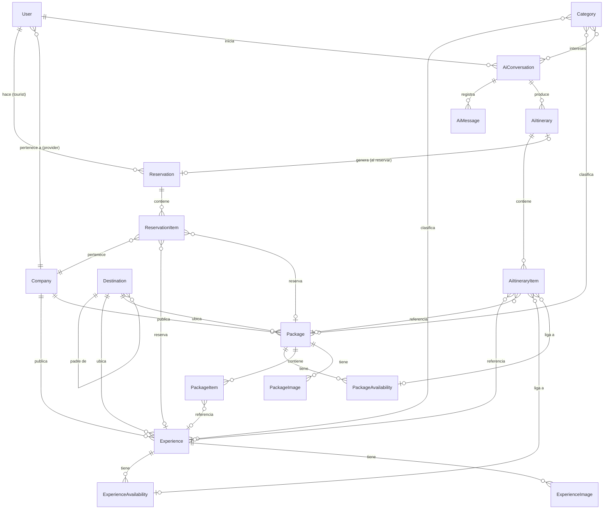

# TurisClick — FASE 2: Diseño del dominio

Fuente de verdad funcional: [`docs/use-cases.md`](./use-cases.md). Cada entidad de este documento existe porque al menos un caso de uso la requiere; la referencia `(UC-xx)` junto a cada entidad apunta a su justificación. Todavía no se define tipo físico de columnas, PK/FK reales ni migraciones — eso es FASE 3.

## Convenciones generales

- **Identificador:** todas las entidades tienen un identificador único (`Id`); el tipo concreto (GUID vs. bigint identity) se decide en FASE 3.
- **Auditoría mínima:** salvo que se indique lo contrario, toda entidad tiene `CreatedAt`; las que tienen ciclo de vida editable también tienen `UpdatedAt`.
- **Dinero y moneda:** todo campo de precio va acompañado de su propia `Currency` (código ISO 4217 de 3 letras — USD, BOB, EUR, etc.). El sistema soporta múltiples monedas coexistiendo desde el diseño, pero **no** hay conversión automática ni tabla de tipos de cambio todavía: cada producto se vende y se paga en la moneda que definió su proveedor. `Currency` se valida contra una lista controlada (la forma concreta de validación — `CHECK` constraint vs. tabla de referencia — se decide en FASE 3); no se crea una entidad `ExchangeRate`.
- **Snapshots de precio:** los precios "vigentes" (en `Experience`/`Package`) son mutables por el proveedor; los precios que aparecen dentro de una reserva o de un itinerario IA (`UnitPrice`/`EstimatedUnitPrice` + su propia `Currency`) son **snapshots congelados** en el momento en que se calcularon (UC-SYS-02), no referencias vivas — así una reserva confirmada no cambia de precio ni de moneda si el proveedor edita después su tarifa.
- **Totales multi-moneda:** como un itinerario IA puede combinar productos de distintos proveedores con distinta `Currency`, `Reservation` y `AiItinerary` **no** persisten un único total agregado — se calcula en Service/DTO (ver detalle en sus secciones).
- **Aislamiento por empresa:** toda entidad de catálogo (`Experience`, `Package`) cuelga de exactamente una `Company`. La pertenencia se usa para autorizar operaciones de PROVIDER (UC-SYS-03).

---

## 1. Autenticación / Usuarios

### `User`
Soporta UC-AUTH-01..04, UC-A-06, y es el punto de partida de TOURIST/PROVIDER/ADMIN.

| Atributo | Descripción |
|---|---|
| Id | Identificador único |
| FirstName | Nombre |
| LastName | Apellido |
| Email | Único en el sistema |
| PasswordHash | Hash de contraseña |
| Role | `UserRole`: `TOURIST`, `PROVIDER`, `ADMIN` |
| Status | `UserStatus`: `ACTIVE`, `SUSPENDED` |
| CompanyId | FK opcional a `Company` — solo aplica si `Role = PROVIDER` |
| CreatedAt | — |

`FullName` **no** es un atributo propio: se calcula como `FirstName + " " + LastName` donde haga falta mostrarlo (UI, notificaciones), sin guardarlo como columna redundante.

**Relaciones:**
- `User (PROVIDER)` **N—1** `Company` (decisión 5: una empresa puede tener varios usuarios PROVIDER a futuro; hoy normalmente uno).
- `User (TOURIST)` **1—N** `Reservation`, **1—N** `AiConversation`, **1—N** `AiItinerary`.
- `User (ADMIN)` **1—N** `Company` (como aprobador, ver `Company.ApprovedByUserId`).

### `RefreshToken`
Soporta UC-AUTH-03/04 (renovar y revocar sesión). Es un detalle técnico de autenticación, no una entidad de negocio, pero forma parte del dominio de auth porque su ciclo de vida (emisión/revocación) es una regla, no solo infraestructura.

| Atributo | Descripción |
|---|---|
| Id | — |
| UserId | FK a `User` |
| TokenHash | Hash del refresh token |
| ExpiresAt | Expiración |
| RevokedAt | Nulo mientras esté vigente |
| CreatedAt | — |

**Relación:** `User` **1—N** `RefreshToken`.

---

## 2. Proveedores

### `Company`
Soporta UC-P-01/02/03, UC-A-01/02/03/08.

| Atributo | Descripción |
|---|---|
| Id | — |
| Name | Nombre comercial |
| Description | — |
| LegalDocument | Documento legal/tributario |
| ContactEmail, ContactPhone | — |
| Status | `CompanyStatus`: `PENDING_APPROVAL`, `APPROVED`, `REJECTED`, `SUSPENDED` |
| ApprovedByUserId | FK opcional a `User` (ADMIN que aprobó/rechazó) |
| ApprovedAt | Nulo hasta aprobación |
| RejectionReason | Solo si `Status = REJECTED` |
| CreatedAt | — |

**Relaciones:**
- `Company` **1—N** `User` (usuarios PROVIDER de esa empresa).
- `Company` **1—N** `Experience`.
- `Company` **1—N** `Package`.
- `Company` **1—N** `ReservationItem` (a través del producto reservado — ver más abajo por qué se denormaliza).

**Regla:** un `PROVIDER` solo puede crear/editar `Experience`/`Package` cuando su `Company.Status = APPROVED` (Regla 1 de FASE 1).

---

## 3. Catálogo turístico (compartido)

### `Destination`
Soporta decisión 10, UC-A-04, UC-T-03, y es referenciado por `Experience`/`Package`.

| Atributo | Descripción |
|---|---|
| Id | — |
| Name | — |
| Type | `DestinationType`: `COUNTRY`, `REGION`, `CITY` |
| ParentId | FK opcional a `Destination` (nulo solo para `COUNTRY`) |

**Relación:** `Destination` **1—N** `Destination` (jerarquía Country → Region → City, autorreferencial).

**Regla:** `Experience.DestinationId` y `Package.DestinationId` deben apuntar a un `Destination` de tipo `CITY` (el nivel más específico) — así la búsqueda por región/país (UC-T-03/04/06) se resuelve recorriendo la jerarquía hacia arriba, no duplicando destino en varios niveles por producto.

### `Category`
Soporta UC-A-05, filtros UC-T-04/06.

| Atributo | Descripción |
|---|---|
| Id | — |
| Name | — |
| Description | Opcional |

**Relaciones:** `Category` **N—N** `Experience`, `Category` **N—N** `Package`, `Category` **N—N** `AiConversation` (intereses del turista — ver sección IA).

---

## 4. Experiencias

### `Experience`
Soporta UC-P-04/05/06/10, UC-T-04/05.

| Atributo | Descripción |
|---|---|
| Id | — |
| CompanyId | FK a `Company` |
| DestinationId | FK a `Destination` (tipo `CITY`) |
| Title | — |
| Description | — |
| IncludesText | Texto libre: qué incluye |
| ExcludesText | Texto libre: qué no incluye |
| DurationMinutes | Duración estructurada en minutos (nullable) — necesaria para que la IA compare duraciones y organice varias experiencias dentro de un mismo día del itinerario (UC-AI-04) |
| DurationLabel | Texto libre opcional para presentación (ej. "medio día", "4 horas"); si falta, la UI puede derivar un texto genérico a partir de `DurationMinutes` |
| Price | Precio vigente de referencia |
| Currency | — |
| Status | `PublicationStatus`: `DRAFT`, `PUBLISHED`, `UNPUBLISHED`, `SUSPENDED` |
| CreatedAt, UpdatedAt | — |

**Relaciones:**
- `Experience` **N—1** `Company`, **N—1** `Destination`, **N—N** `Category`.
- `Experience` **1—N** `ExperienceImage`.
- `Experience` **1—N** `ExperienceAvailability`.
- `Experience` **1—N** `PackageItem` (cuando es referenciada desde un paquete), **1—N** `AiItineraryItem`, **1—N** `ReservationItem` (referencias de solo lectura, no de composición).

### `ExperienceImage`
Soporta la galería de imágenes explícita en la descripción funcional de una Experience (UC-T-05).

| Atributo | Descripción |
|---|---|
| Id | — |
| ExperienceId | FK a `Experience` |
| Url | — |
| SortOrder | Orden de la galería |
| IsCover | Marca la imagen de portada (agregado por consistencia con `PackageImage`; también la usa UC-T-04 para mostrar una miniatura representativa en resultados de búsqueda sin cargar la galería completa) |

**Regla:** a lo sumo un `ExperienceImage` por `Experience` con `IsCover = true`.

---

## 5. Paquetes

### `Package`
Soporta UC-P-07/08/09/11, UC-T-06/07.

| Atributo | Descripción |
|---|---|
| Id | — |
| CompanyId | FK a `Company` |
| DestinationId | FK a `Destination` (destino principal, tipo `CITY`) |
| Title | — |
| Description | — |
| ConditionsText | Texto libre: condiciones/qué incluye-excluye a nivel paquete |
| DurationDays | Número de días del paquete (define el rango válido de `PackageItem.DayNumber`) |
| Price | Precio total definido por el proveedor (no se deriva de sus ítems) |
| Currency | — |
| Status | `PublicationStatus`: `DRAFT`, `PUBLISHED`, `UNPUBLISHED`, `SUSPENDED` |
| CreatedAt, UpdatedAt | — |

**Relaciones:**
- `Package` **N—1** `Company`, **N—1** `Destination`, **N—N** `Category`.
- `Package` **1—N** `PackageItem`.
- `Package` **1—N** `PackageAvailability`.
- `Package` **1—N** `PackageImage`.
- `Package` **1—N** `AiItineraryItem`, **1—N** `ReservationItem` (referencias de solo lectura).

### `PackageItem`
Es la entidad que materializa la **decisión 1**: un paquete combina experiencias reales reutilizables con ítems puramente descriptivos.

| Atributo | Descripción |
|---|---|
| Id | — |
| PackageId | FK a `Package` |
| DayNumber | Día del paquete al que pertenece (1..`Package.DurationDays`) |
| SortOrder | Orden dentro del día |
| Kind | `PackageItemKind`: `EXPERIENCE_REFERENCE`, `DESCRIPTIVE` |
| ExperienceId | FK opcional a `Experience` — **obligatorio si y solo si** `Kind = EXPERIENCE_REFERENCE` |
| Title | Obligatorio si `Kind = DESCRIPTIVE` (ej. "Traslado al aeropuerto", "Desayuno incluido"); si es `EXPERIENCE_REFERENCE` puede quedar vacío y mostrarse el título de la Experience |
| Description | Texto adicional opcional |

**Regla de negocio (invariante):**
- Si `Kind = EXPERIENCE_REFERENCE` → `ExperienceId` requerido y `Experience.CompanyId == Package.CompanyId` (un paquete no puede incluir la experiencia de otro proveedor — comercialmente sigue siendo producto de una sola empresa).
- Si `Kind = DESCRIPTIVE` → `ExperienceId` debe ser nulo.

### `PackageImage`
Un paquete es un producto comercial independiente y puede necesitar imágenes distintas de las `Experience` que contiene — no depende de la galería de sus ítems.

| Atributo | Descripción |
|---|---|
| Id | — |
| PackageId | FK a `Package` |
| Url | — |
| SortOrder | Orden de la galería |
| IsCover | Marca la imagen de portada |

**Regla:** a lo sumo un `PackageImage` por `Package` con `IsCover = true`.

---

## 6. Disponibilidad

Ambas entidades siguen la **decisión 8**: fechas/slots concretos, modelo abierto a evolucionar hacia recurrencia (una futura `AvailabilityRule` podría generarlos, pero no se modela todavía porque ningún caso de uso actual la requiere).

### `ExperienceAvailability`
Soporta UC-P-10, UC-SYS-01/06.

| Atributo | Descripción |
|---|---|
| Id | — |
| ExperienceId | FK a `Experience` |
| Date | Fecha del turno |
| StartTime | Opcional. Si es `null`, el slot se interpreta como disponibilidad de **día completo** — nunca se infiere ni se guarda una hora aproximada |
| TotalSlots | Cupos totales |
| ReservedSlots | Cupos ya retenidos/confirmados (contador para descuento atómico, UC-SYS-06) |
| Status | `AvailabilitySlotStatus`: `OPEN`, `CLOSED` (cierre manual del proveedor, independiente de si hay cupo) |

`AvailableSlots` (= `TotalSlots - ReservedSlots`) es un valor calculado, no una columna propia.

### `PackageAvailability`
Soporta UC-P-11, UC-SYS-01/06. Misma forma que `ExperienceAvailability` pero a nivel de fecha de salida del paquete completo.

| Atributo | Descripción |
|---|---|
| Id | — |
| PackageId | FK a `Package` |
| DepartureDate | Fecha de salida |
| TotalSlots | — |
| ReservedSlots | — |
| Status | `AvailabilitySlotStatus`: `OPEN`, `CLOSED` |

---

## 7. Reservas (modelo unificado aprobado)

### `Reservation` (padre)
Soporta UC-T-08/09/10/18/19, UC-SYS-04/05/07/08. Es el mismo tipo de entidad tanto para una compra directa de una Experience/Package como para un itinerario IA reservado — solo cambia cuántos `ReservationItem` tiene y si vienen de un `AiItinerary`.

| Atributo | Descripción |
|---|---|
| Id | — |
| TouristId | FK a `User` |
| AiItineraryId | FK opcional a `AiItinerary` — presente únicamente si esta reserva se originó en un itinerario IA (UC-T-18). **Único entre las reservas ACTIVAS** (índice único parcial `WHERE ai_itinerary_id IS NOT NULL AND status NOT IN ('EXPIRED','CANCELLED')`, migración 0008): un itinerario tiene como máximo una reserva reteniendo cupo, y es esa unicidad la que hace idempotente al booking ante dos requests concurrentes. Las reservas terminales se conservan para auditoría, lo que permite volver a reservar un itinerario cuya reserva expiró (Oleada 8). El filtro excluye estados terminales en vez de listar los activos: así cualquier estado nuevo bloquea por defecto, que es el lado seguro |
| Status | `ReservationStatus`: `PENDING_PAYMENT`, `CONFIRMED`, `PAYMENT_FAILED`, `CANCELLED`, `EXPIRED` — representa el ciclo de vida de la reserva **como un todo** (pago, cancelación explícita del turista, expiración); no cambia automáticamente por una cancelación parcial a nivel de ítem (ver nota más abajo) |
| ExpiresAt | Límite del hold de cupo mientras está `PENDING_PAYMENT` (UC-SYS-08) |
| CreatedAt, ConfirmedAt, CancelledAt | Nulos según corresponda |

**Relación:** `Reservation` **1—N** `ReservationItem`, **N—1** `User` (turista), **N—1** `AiItinerary` (opcional).

> **Cambio respecto a la versión anterior — se eliminan `TotalPrice`/`Currency` de `Reservation`.** Un itinerario IA puede combinar `ReservationItem` de distintos proveedores con distinta `Currency` (decisión de moneda múltiple), así que un total único agregado dejaría de ser válido en ese caso. El total se calcula en Service/DTO agrupando `Subtotal` por `Currency` de sus `ReservationItem`: en el caso típico (reserva directa, o itinerario mono-moneda) da un solo total; si hay mezcla, se presenta el desglose por moneda. No se persiste por ser puro dato derivado.

> Nota de diseño: **no** se agrega un campo `Type` (directa-experiencia / directa-paquete / itinerario-IA) porque es derivable — si `AiItineraryId` no es nulo, es de itinerario; si es nulo, se infiere del único `ReservationItem.ProductType` (una reserva directa siempre tiene exactamente un ítem, UC-SYS-04). Persistirlo sería un dato redundante sin caso de uso propio; si en el futuro se necesita para reportes, se calcula en la capa de Service/DTO.

> **Expiración y AiItinerary (Oleada 8).** Cuando una `Reservation` `PENDING_PAYMENT` vence sin pago (UC-SYS-08), la reserva pasa a `EXPIRED`, sus líneas activas también, se libera el cupo y —si venía de un itinerario IA— el `AiItinerary` vuelve de `BOOKED` a `SAVED`, todo en la misma transacción. El turista puede volver a reservarlo, pero **siempre pasando de nuevo por toda la revalidación final de UC-T-18**: nunca se reutilizan como verdad los precios ni la disponibilidad anteriores. Qué ocurre al expirar una reserva `CONFIRMED` no aplica: una reserva confirmada no expira.

> **Cancelación parcial (decisión del usuario).** Un proveedor puede cancelar únicamente el `ReservationItem` que le corresponde (UC-P-14); los demás ítems y la `Reservation` padre siguen activos. No se agrega un estado `PARTIALLY_CANCELLED` a `ReservationStatus`: es derivable y barato de calcular — si existe al menos un `ReservationItem` en `CANCELLED` y al menos otro que no lo está, la UI presenta la reserva como "parcialmente cancelada" a partir de un `GROUP BY Status` sobre sus ítems (una reserva rara vez tiene más de una decena de líneas). `Reservation.Status` solo pasa a `CANCELLED` cuando la cancela explícitamente el turista (UC-T-11) o el sistema la cancela por completo (ej. expiración sin pago, UC-SYS-08).

### `ReservationItem` (hijo)
Soporta UC-T-10/18/19, UC-P-12/13/14, UC-SYS-01/02/04/05/06/07/08. Representa **una línea reservable de un solo proveedor**, y es la pieza clave de la decisión 2 (reserva padre + hijas).

| Atributo | Descripción |
|---|---|
| Id | — |
| ReservationId | FK a `Reservation` |
| CompanyId | FK a `Company` — **denormalizado deliberadamente** para que UC-P-12 (listar reservas recibidas) y UC-SYS-03 (validar propiedad) no dependan de un join hasta `Experience`/`Package` en cada consulta |
| ProductType | `ProductType`: `EXPERIENCE`, `PACKAGE` |
| ExperienceId | FK opcional — obligatorio si `ProductType = EXPERIENCE` |
| PackageId | FK opcional — obligatorio si `ProductType = PACKAGE` |
| ExperienceAvailabilityId | FK opcional — el slot exacto reservado, si `ProductType = EXPERIENCE` |
| PackageAvailabilityId | FK opcional — la salida exacta reservada, si `ProductType = PACKAGE` |
| Travelers | Número de personas |
| UnitPrice | Precio **congelado** al momento de reservar (snapshot, resultado de UC-SYS-02) |
| Currency | Moneda de `UnitPrice`/`Subtotal` — snapshot propio por línea; no se asume igual a la de otros ítems de la misma `Reservation` (decisión de moneda múltiple) |
| Subtotal | `UnitPrice * Travelers` en el caso general |
| Status | `ReservationItemStatus`: `PENDING_PAYMENT`, `CONFIRMED`, `CANCELLED`, `EXPIRED` — puede diferir del estado del padre si un proveedor cancela solo su parte (UC-P-14). `EXPIRED` se agrega en Oleada 8 para distinguir "venció sin pago" de "alguien decidió cancelar": son eventos de dominio distintos y conviene auditarlos por separado |
| CancelledAt | Cuándo dejó de estar activa la línea (cancelación o expiración). Nulo mientras siga vigente |
| CancellationReason | Motivo que dejó el proveedor al cancelar su línea (UC-P-14). Nulo en el resto de los casos — **quién** canceló es derivable: si la `Reservation` padre también tiene `CancelledAt`, fue el turista sobre todo el viaje; si solo lo tiene la línea, fue el proveedor sobre su parte |
| DayNumber | Opcional; solo tiene sentido si `Reservation.AiItineraryId` no es nulo, para reconstruir el orden del viaje en UC-T-10 |
| CreatedAt | — |

**Regla de negocio (invariante):** exactamente uno de (`ExperienceId`, `ExperienceAvailabilityId`) o (`PackageId`, `PackageAvailabilityId`) debe estar presente, según `ProductType`.

**Relaciones:** `ReservationItem` **N—1** `Reservation`, **N—1** `Company`, **N—1** (`Experience` **o** `Package`), **N—1** (`ExperienceAvailability` **o** `PackageAvailability`).

---

## 8. Inteligencia artificial

### `AiConversation`
Soporta UC-T-12/13/15. Absorbe también las preferencias de viaje (`TripPreferences`) como atributos propios en lugar de una entidad aparte: no hay ningún caso de uso que consulte preferencias independientemente de su conversación, y es una relación 1—1 sin ciclo de vida propio — modelarla aparte sería una entidad sin justificación funcional autónoma.

| Atributo | Descripción |
|---|---|
| Id | — |
| TouristId | FK a `User` |
| Status | `AiConversationStatus`: `ACTIVE`, `CLOSED` |
| **Preferencias interpretadas (UC-AI-01):** | |
| PreferredDestinationId | FK opcional a `Destination` |
| StartDate, EndDate | Fechas del viaje, opcionales |
| TravelersCount | Opcional |
| BudgetTotal, Currency | Opcional |
| DurationDays | Opcional (puede derivarse de StartDate/EndDate si ambas existen) |
| RestrictionsNotes | Texto libre (ej. "no actividades exigentes") |
| CreatedAt, UpdatedAt | — |

**Relaciones:**
- `AiConversation` **N—1** `User` (turista).
- `AiConversation` **1—N** `AiMessage`.
- `AiConversation` **1—N** `AiItinerary` (una conversación puede producir varias versiones/propuestas guardadas a lo largo del tiempo).
- `AiConversation` **N—N** `Category` (intereses del turista, reutilizando el catálogo real en vez de texto libre — así UC-AI-02 puede filtrar por categoría real).

### `AiMessage`
Soporta UC-T-13/15 (historial conversacional).

| Atributo | Descripción |
|---|---|
| Id | — |
| AiConversationId | FK a `AiConversation` |
| Sender | `MessageSender`: `TOURIST`, `AI` |
| Content | Texto del mensaje |
| CreatedAt | — |

### `AiItinerary`
Soporta UC-T-14/16/17/18, UC-AI-03/04/05/06, UC-SYS-05. Es la propuesta persistible (**decisión 7**).

| Atributo | Descripción |
|---|---|
| Id | — |
| AiConversationId | FK a `AiConversation` |
| TouristId | FK a `User` — denormalizado para listar "Mis itinerarios" (UC-T-17) sin pasar por la conversación |
| Title | Ej. "Tu viaje a La Paz" |
| Status | `AiItineraryStatus`: `DRAFT` (transitorio de la sesión), `SAVED` (persistido explícitamente por el turista), `BOOKED` (ya generó una `Reservation`), `DISCARDED` |
| Version | Se incrementa en cada ajuste (UC-AI-05), para trazabilidad de la iteración conversacional. **Implementación (Oleada 6):** cada ajuste inserta una **fila nueva** con `Version = anterior + 1` en estado `DRAFT`; la versión anterior no se modifica ni se borra (si estaba `SAVED`, sigue `SAVED`), así queda el historial completo de cómo evolucionó la propuesta |
| CreatedAt, UpdatedAt | — |

**Relaciones:** `AiItinerary` **N—1** `AiConversation`, **N—1** `User`, **1—N** `AiItineraryItem`, **1—1 opcional** `Reservation` (vía `Reservation.AiItineraryId`, una vez reservado).

> Igual que en `Reservation`, no se persiste un `EstimatedTotalPrice`/`Currency` único agregado: el itinerario puede combinar productos en distintas monedas. El total (o desglose por moneda) se calcula en Service/DTO a partir de `AiItineraryItem.EstimatedUnitPrice`/`Currency`.

### `AiItineraryItem`
Soporta UC-AI-04/05, UC-T-14, UC-SYS-05. Mismo patrón que `ReservationItem` porque cumple el mismo rol (una línea que referencia un producto real), pero antes de convertirse en reserva.

| Atributo | Descripción |
|---|---|
| Id | — |
| AiItineraryId | FK a `AiItinerary` |
| DayNumber | Día del itinerario propuesto |
| SortOrder | Orden dentro del día |
| ProductType | `ProductType`: `EXPERIENCE`, `PACKAGE` |
| ExperienceId | FK opcional — obligatorio si `ProductType = EXPERIENCE` |
| PackageId | FK opcional — obligatorio si `ProductType = PACKAGE` |
| ExperienceAvailabilityId | FK opcional a `ExperienceAvailability` — el slot concreto propuesto, una vez que la IA ya fijó fecha/horario; puede quedar `null` mientras la propuesta todavía razona en términos de "Día N" sin una fecha calendario definitiva |
| PackageAvailabilityId | FK opcional a `PackageAvailability` — análogo, cuando `ProductType = PACKAGE` |
| EstimatedUnitPrice, Currency | Precio recuperado en el momento de la propuesta (UC-AI-02). Es un **snapshot histórico: nunca se sobrescribe**, ni al iterar (un ítem preservado viaja a la versión nueva con su precio original) ni al releer. **Implementación (Oleada 6):** además de la validación previa a reservar (UC-T-18), cada lectura (UC-T-14/17) revalida contra el catálogo y expone el estado vigente *al lado* del snapshot (`currentPrice`, `currentCurrency`, `currentAvailableSlots`, `priceChanged`, `availabilityState`, `warnings`), sin escribir en la base |

**Regla de negocio (invariante):**
- Igual que `ReservationItem` — exactamente uno de `ExperienceId`/`PackageId` según `ProductType`, y (si está presente) el availability correspondiente debe pertenecer a ese mismo producto. Este ítem **nunca** contiene datos inventados: siempre referencia una fila real de `Experience` o `Package`.
- Antes de UC-T-18 (aceptar y reservar), todo `AiItineraryItem` debe tener resuelto su `ExperienceAvailabilityId`/`PackageAvailabilityId`; si la propuesta aún no lo tenía, el sistema debe asignarlo o la revalidación (UC-SYS-01/02) debe fallar explícitamente.

**Relación adicional:** `AiItineraryItem` **N—1 opcional** `ExperienceAvailability`, **N—1 opcional** `PackageAvailability`.

---

## Enums consolidados

| Enum | Valores |
|---|---|
| `UserRole` | `TOURIST`, `PROVIDER`, `ADMIN` |
| `UserStatus` | `ACTIVE`, `SUSPENDED` |
| `CompanyStatus` | `PENDING_APPROVAL`, `APPROVED`, `REJECTED`, `SUSPENDED` |
| `DestinationType` | `COUNTRY`, `REGION`, `CITY` |
| `PublicationStatus` (Experience y Package) | `DRAFT`, `PUBLISHED`, `UNPUBLISHED`, `SUSPENDED` |
| `PackageItemKind` | `EXPERIENCE_REFERENCE`, `DESCRIPTIVE` |
| `AvailabilitySlotStatus` | `OPEN`, `CLOSED` |
| `ReservationStatus` | `PENDING_PAYMENT`, `CONFIRMED`, `PAYMENT_FAILED`, `CANCELLED`, `EXPIRED` |
| `ReservationItemStatus` | `PENDING_PAYMENT`, `CONFIRMED`, `CANCELLED`, `EXPIRED` |
| `ProductType` (ReservationItem y AiItineraryItem) | `EXPERIENCE`, `PACKAGE` |
| `AiConversationStatus` | `ACTIVE`, `CLOSED` |
| `MessageSender` | `TOURIST`, `AI` |
| `AiItineraryStatus` | `DRAFT`, `SAVED`, `BOOKED`, `DISCARDED` |

---

## Reglas de negocio / invariantes transversales

1. Un `PROVIDER` solo puede crear/editar `Experience`/`Package` si su `Company.Status = APPROVED`.
2. Un `PROVIDER` solo puede leer/editar recursos cuyo `CompanyId` coincide con el de su propio usuario (UC-SYS-03).
3. `PackageItem.Kind = EXPERIENCE_REFERENCE` exige `Experience.CompanyId == Package.CompanyId`.
4. Ninguna reserva pasa a `CONFIRMED` sin que `UnitPrice` y disponibilidad se hayan revalidado contra los datos reales en el momento de la operación (UC-SYS-01/02), nunca contra un valor cacheado del cliente.
5. `ReservedSlots` se actualiza de forma atómica al crear/cancelar un `ReservationItem`, para evitar overbooking con reservas concurrentes (UC-SYS-06).
6. Un `AiItineraryItem`/`ReservationItem` siempre referencia una `Experience` o `Package` real — la IA nunca persiste un producto inexistente.
7. Al aceptar un `AiItinerary` (UC-T-18), se crea una única `Reservation` padre con un `ReservationItem` por cada `AiItineraryItem`; cada `ReservationItem` hereda el `CompanyId` del producto referenciado, habilitando que cada proveedor solo vea su parte (UC-P-12).
8. `Reservation.Status = CONFIRMED` se dispara automáticamente cuando el pago es exitoso y el cupo sigue disponible (decisión 6) — no requiere aceptación manual del proveedor.
9. Una `Company`, `Experience` o `Package` con estado `SUSPENDED` (por ADMIN) desaparece del catálogo público aunque conserve sus datos e histórico de reservas.
10. `Destination.Type` de un producto (`Experience`/`Package`) siempre es `CITY`; la búsqueda por región o país se resuelve subiendo por `ParentId`.
11. Si `ExperienceAvailability.StartTime` es `null`, el slot se interpreta como disponibilidad de día completo; nunca se infiere una hora aproximada.
12. Cada `Experience`/`Package` fija su propia `Currency`; `ReservationItem`/`AiItineraryItem` conservan esa moneda como snapshot independiente por línea — un `Reservation`/`AiItinerary` puede terminar con líneas en distintas monedas, y su total se calcula agrupado por moneda (no como un único agregado persistido).
13. La cancelación de un `ReservationItem` es independiente del resto de ítems de su `Reservation`: solo afecta a ese ítem y a su proveedor; `Reservation.Status` no se deriva automáticamente a `CANCELLED` por una cancelación parcial (se calcula un indicador de "parcialmente cancelada" en Service/DTO cuando haga falta).
14. Antes de convertir un `AiItineraryItem` en `ReservationItem` (UC-T-18), debe tener resuelto un slot concreto (`ExperienceAvailabilityId`/`PackageAvailabilityId`); si la propuesta aún no lo tenía, el sistema debe asignarlo o la revalidación debe fallar explícitamente informando al turista.

---

## Entidades evaluadas y descartadas o fusionadas (disciplina de "solo lo necesario")

- **`TripPreferences` como entidad aparte** → fusionada como atributos de `AiConversation` (relación 1—1 sin ciclo de vida propio, ningún UC la consulta de forma independiente).
- **`Reservation.Type`** → descartado por ser derivable de `AiItineraryId` + `ReservationItem.ProductType`; se calcula en Service/DTO, no se persiste.
- **`Payment`** → no se modela todavía. Por la decisión 4, el desacople reserva/pago se resuelve solo con `ReservationStatus` (`PENDING_PAYMENT` → `CONFIRMED`/`PAYMENT_FAILED`); cuando se integre una pasarela real (fuera del alcance actual) recién se justificará una entidad `Payment` con su propio ciclo de vida (intentos, referencia externa, etc.).
- **`Review` / `Favorite`** → explícitamente backlog en `use-cases.md`, no se modelan ahora.
- **`AvailabilityRule` (recurrencia)** → no se modela; la decisión 8 pide dejar el diseño *abierto* a evolucionar, no implementarlo ya. `ExperienceAvailability`/`PackageAvailability` ya son suficientes para slots concretos y no impiden agregar un generador de recurrencia después.
- **Entidad `Media` polimórfica compartida por Experience/Package** → se evaluó y se descartó a favor de dos tablas explícitas (`ExperienceImage`, `PackageImage`): son estructuralmente casi idénticas pero pertenecen a agregados distintos con reglas de portada (`IsCover`) independientes; unificarlas exigiría una FK polimórfica sin integridad referencial real en PostgreSQL, a cambio de ahorrar una tabla casi idéntica — no compensa la complejidad.
- **`ExchangeRate` / servicio de conversión FX** → no se modela. El soporte multi-moneda (decisión del usuario) se limita a que cada línea de precio conserve su propia `Currency` como dato; convertir entre monedas queda fuera de alcance hasta que exista un caso de uso que lo requiera explícitamente.
- **`AvailabilitySlot` de recurrencia (`AvailabilityRule`) para `AiItineraryItem`** → se evaluó exponer directamente `Date`/`StartTime` en `AiItineraryItem` en vez de una FK a `ExperienceAvailability`/`PackageAvailability`, pero se descartó: duplicaría datos que ya vive en el slot real y podría desincronizarse (ej. el proveedor cierra el slot y el itinerario seguiría mostrando la fecha vieja). Referenciar el slot real mantiene una única fuente de verdad.

---

## Diagrama conceptual (relaciones principales)

---

## Cierre de FASE 2 — decisiones aplicadas en esta revisión

| # | Punto | Decisión |
|---|---|---|
| 1 | Galería de paquetes | Se agrega `PackageImage` (`PackageId`, `Url`, `SortOrder`, `IsCover`), independiente de `ExperienceImage`. Por consistencia, se agregó `IsCover` también a `ExperienceImage`. |
| 2 | Moneda | Soporte multi-moneda desde el diseño: `Currency` (ISO 4217) en `Experience`, `Package`, `ReservationItem` y `AiItineraryItem`, cada uno como snapshot independiente. Sin `ExchangeRate` ni conversión automática. Como consecuencia directa, se eliminaron los totales agregados `TotalPrice`/`EstimatedTotalPrice` de `Reservation` y `AiItinerary` (se calculan en Service/DTO, agrupados por moneda si hace falta). |
| 3 | `ExperienceAvailability.StartTime` | Queda opcional; `null` = disponibilidad de día completo, sin inventar una hora aproximada. |
| 4 | Cancelación parcial | Un `ReservationItem` se cancela de forma independiente; `Reservation.Status` no se deriva automáticamente a un estado nuevo — no se agrega `PARTIALLY_CANCELLED` porque es calculable de forma barata (`GROUP BY Status` sobre los pocos ítems de una reserva). |
| A | `Experience.DurationMinutes` | Se agrega duración estructurada en minutos (además del `DurationLabel` de presentación), necesaria para que la IA compare y organice experiencias por día (UC-AI-04). |
| B | `AiItineraryItem` y disponibilidad | Se agregan `ExperienceAvailabilityId`/`PackageAvailabilityId` opcionales, para que una propuesta ya pueda quedar ligada a un slot real concreto antes de reservar. |

Ningún otro cambio queda pendiente de tu confirmación — el modelo de dominio queda cerrado con esta versión de `docs/domain-model.md`. Continúo con **FASE 3 — Diseño de base de datos**.
